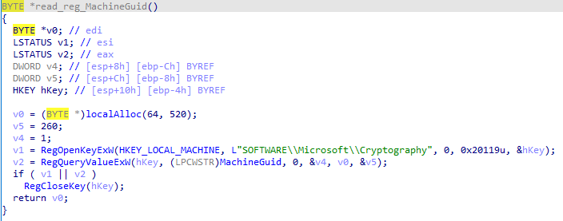

# Threat Intelligence Rundown

Reports used (in order of value):
* [Sekoia](https://blog.sekoia.io/raccoon-stealer-v2-part-2-in-depth-analysis/#h-host-checking)
* [Any.Run](https://any.run/cybersecurity-blog/raccoon-stealer-v2-malware-analysis/)
* [Zscaler](https://www.zscaler.com/blogs/security-research/raccoon-stealer-v2-latest-generation-raccoon-family)
* [Infosec Writeups](https://infosecwriteups.com/raccoon-stealer-v2-malware-analysis-55cc33774ac8)
* [CyberInt](https://cyberint.com/blog/research/raccoon-stealer/)

# Overall Flow

## 0. Debugger Evasion

We skipped this to save on development time as we did not have an objective to test our reverse engineering folks with this exercise.

## 1. Dynamic Linking
Raccoon first loads `Shell32.dll`, `WinInt.dll`, `Crypt32.dll`, `Ole32.dll`, `User32.dll`, `Advapi32.dll` and `Kernel32.dll`  using LoadLibrary and GetProcAddress - these calls are not obfuscated in any way.

The Zscaler and AnyRun reports also list `Shlwapi.dll` (Search for "List of Loaded DLLs" in Zscaler or see the screenshot below). Shlwapi seems to be most applicable to pre-Vista Windows and can possibly be ignored, as it was in our implementation.

Once the DLLs are loaded, **all** Windows API calls are resolved by address and stored in global variables. Interestingly, these function names are not obfuscated like the rest of the string literals.

E.g.
```cpp
pLoadLibrary = (HModule (__stdcall *)(LPCWSTR))GetProcAddress(hKernel32, "LoadLibraryW");
hShell32 = pLoadLibrary(L"Shell32.dll")
...
```


Sources:

[Sekoia](https://blog.sekoia.io/raccoon-stealer-v2-part-2-in-depth-analysis/#h-run-time-dynamic-linking)

[AnyRun](https://any.run/cybersecurity-blog/raccoon-stealer-v2-malware-analysis/#execution-process-of-recordbreaker-malware-2711)

[Zscaler](https://www.zscaler.com/blogs/security-research/raccoon-stealer-v2-latest-generation-raccoon-family)

## 2. String Deobfuscation
All string literals (save for Windows API function names, addressed above) are stored in global variables encrypted with RC4 and wrapped in B64 (or with XOR, depending on the sample). After setting up the API links, these strings are decrypted along with the encrypted IP address for C2.


Sources:

[Sekoia](https://blog.sekoia.io/raccoon-stealer-v2-part-2-in-depth-analysis/#h-obfuscation-techniques)

AnyRun (Search for "Decryption of strings")

Zscaler (Search for "Figure 4")

[Infosec Writeup](https://infosecwriteups.com/raccoon-stealer-v2-malware-analysis-55cc33774ac8) (Search for "Decrypting Strings and C2 IP Address")

## 3. Mutex Creation/Check and Locale Check
This stage would abort execution if the mutex exists. Several samples included `8724643052` as the mutex entry, which we have used. If the mutex doesn't exist, it's created and execution continues. Otherwise, the program terminates and calls the self deletion function.


Based on the AnyRun report, Raccoon also also checks for the infected host's locale - if it is any CIS country, it terminates and calls the self deletion function.


Sources:

[Sekoia](https://blog.sekoia.io/raccoon-stealer-v2-part-2-in-depth-analysis/#h-mutex) (Mutex only)

AnyRun (Search for "Racoon termination triggers") (Mutex and Locale)

Infosec Writeup (Search for "Checking Mutex")

Zscaler (Search for "Overhead Before Exfiltration")

## 4. Privilege Check
Racoon checks for SYSTEM privileges and does additional process discovery if it is running as SYSTEM. We implemented the SYSTEM check, but did not plan to run as SYSTEM and as such skipped the additional process checks to save on development time.


Sources:

[Sekoia](https://blog.sekoia.io/raccoon-stealer-v2-part-2-in-depth-analysis/#h-host-checking)

AnyRun (Search for "Privilege Level Check")

## 5. Initial C2
### 5a. Generating a Machine ID
The initial POST to C2 includes a string that follows the following convention:

```
machineId={machineguid}|{username}&configId={c2_key}
```

The MachineGUID is retrieved from the registry (`HKLM:\SOFTWARE\Microsoft\Cryptography\MachineGuid`)



The username is retrieved with `GetUserNameW`


Sources:

[Sekoia](https://blog.sekoia.io/raccoon-stealer-v2-part-2-in-depth-analysis/#h-initial-c2-communication)

Zscaler (Search for "Fingerprinting Host")

### 5b. Sending the POST
This initial POST is sent to the **root of the server**. No code samples are available for the actual function. It typically loops over an array of decrypted C2 strings, but for this implementation, it's a single, hardcoded C2 location.


According to the Infosec Writeups report, this response is checked for length greater than 63 bytes. If it's shorter, the loop is skipped. Our implementation does not include this due to the hardcoded, single C2 location.

Sources:

[Sekoia](https://blog.sekoia.io/raccoon-stealer-v2-part-2-in-depth-analysis/#h-initial-c2-communication)

Zscaler (Search for "Communications with Command and Control")

AnyRun (Search for "Connecting to C2 Servers")

### 5c. Server Responds with Configuration
The configuration is delivered in **plain text**.

[AnyRun](https://any.run/cybersecurity-blog/raccoon-stealer-v2-malware-analysis/#description-of-the-malware-configuration-structure-2711) has a good table containing the fields, but the information is incomplete as to what the fields mean. Augmenting with [CyberInt](https://cyberint.com/blog/research/raccoon-stealer/) is essential (search for Builds/Config), though it does not cover everything.

## 6. DLL Fetching
The client parses the configuration file, starting with `libs_` which contains entries detailing where to find the legitimate DLLs needed for execution. This list is configurable based on the desired data theft. 

Example entry:

`libs_nss3:http://{HOSTADDR}/{RANDOM_STRING}/nss3.dll`

According to the Sekoia report, these DLLs are downloaded from a separate C2 server to an unspecified folder. Infosec Writeups points to the user's AppData folder.

Sources:

[Sekoia](https://blog.sekoia.io/raccoon-stealer-v2-part-2-in-depth-analysis/#h-dlls-setup)

Infosec Writeup (Search for Figure 13)

## 7. Basic Fingerprinting
Regardless of configuration, Racoon does some basic collection across the User ID, Timezone, OS Version, Architecture, CPU info, RAM capacity, attached displays, and installed applications. This information is written to "System Info.txt" on disk and the ASCII data is embedded in its own POST to the C2 server (`application/x-object`). **This post is sent to a specific endpoint on the server, specified by the configuration file's `token` field.**

AnyRun contained the most data to support recreation of these functions.

Sources:

[Sekoia](https://blog.sekoia.io/raccoon-stealer-v2-part-2-in-depth-analysis/#h-host-fingerprinting)

AnyRun (Search for "System data collection")

## 8. Other Data Theft

### 8a. Generic File Theft
Defined by the `grbr_`  entries in the configuration, which follow the below format with `|` separating fields:

```
grbr_desktop:%USERPROFILE%\Desktop|.*txt|*recycle*,*windows*|20|1|1|files

- prefix_descriptor: <--- NOTE the colon separates the descriptor from the path, no pipe used
- root file path (e.g. c:\)
- The filter(s) to apply (e.g. specific file types)
- Excluded directories
- Size limit in kilobytes (up to 100mb)
- BOOLEAN Whether or not to include subfolders
- BOOLEAN Whether or not to collect files referenced by shortcut
```

Files that match are sent to the C2 server one at a time. They are not staged.


Sources:

[Sekoia](https://blog.sekoia.io/raccoon-stealer-v2-part-2-in-depth-analysis/#h-file-grabber)

AnyRun (Search "Custom files")

CyberInt (Search "file grabber rules")

### 8b. Crypto 
While information is included below, we did not implement any of the crypto theft functions as they are not applicable to our corporate environment.

#### 8b1. Crypto Wallets
Defined by `wlts_`, it follows the below format to search for specified crypto wallets. Reporting isn't clear on how this is broken down, but extrapolating from the `grbr_` analysis, this would correspond to the following (ish).


```
wlts_exodus:Exodus;26;exodus;*;*partitio*,*cache*,*dictionar*

- wlts_descriptor: <-- note the colon again
- Wallet name
- Size? Unclear, but this is an integer
- ??? wildcard
- Search strings to associate files with the target wallet
```


Racoon also looks for `wallet.dat` but apparently doesn't do anything with the file according to Sequoia.


Source:

[Sekoia](https://blog.sekoia.io/raccoon-stealer-v2-part-2-in-depth-analysis/#h-wlts-extraction)

AnyRun (Search for "Crypto-wallets data")

#### 8b2. Crypto Browser Extensions
Denoted with `ews_`, there isn't much information on this functionality. We did not implement this in the interest of time / applicability.

### 8c. Browser Info
#### 8c1. Firefox
We did not implement the Firefox theft functionality due to the prevalence of other browsers for our needs; there is a placeholder for this in the code if you would like to extend it.

The implementation *does* still drop `nss3.dll` to disk to generate the file telemetry, even though it is unused.


Sources:

[Sekoia](https://blog.sekoia.io/raccoon-stealer-v2-part-2-in-depth-analysis/#h-data-extraction-with-nss3-dll)

AnyRun (search for "User data collection" > "Cookies")

#### 8c2. Chrome/Edge Autofill
Uses `sqlite3.dll` but there is not a ton of information on implementation. As such, our recreation uses best practices from other sources (references in the code).

Sources:

[Sekoia](https://blog.sekoia.io/raccoon-stealer-v2-part-2-in-depth-analysis/#h-data-extraction-with-sqlite3-dll)

(AnyRun only details Firefox stuff)

### 8d. Telegram
Similar to crypto theft, we did not implement Telegram theft to save on development time.

Prefaced with `tlgrm`, it follows a similar filter string:

```
tlgrm_Telegram:Telegram Desktop\tdata|*|*emoji*,*user_data*,*tdummy*,*dumps*

- Prefix_descriptor: <-- note the colon
- Path
- Unclear wildcard
- Search string filters
```

### 8e. Screenshot
**Note: This functionality is disabled by default in configurations. We still implemented it.**


A screenshot is taken, but when it's sent to the server it is prefixed by `---` three dashes with a content type of `application/x-object`


Sources:

[Sekoia](https://blog.sekoia.io/raccoon-stealer-v2-part-2-in-depth-analysis/#h-screenshot-capture)

AnyRun (Search "after the malware has sent all the files, it takes a screenshot(s)")

### 8f. Ldr
Different reports describe different functionality for this configuration item.  As we were mostly focused on the data theft, we did not implement this functionality.

AnyRun says the `ldr_` section is for additional commands with `ShellExecW`


Sekoia says `ldr_` is for specifying another PE to execute and whether it's locally available or needs to be downloaded [link](https://blog.sekoia.io/raccoon-stealer-v2-part-2-in-depth-analysis/#h-next-stage-loader)


Sources:

[Sekoia](https://blog.sekoia.io/raccoon-stealer-v2-part-2-in-depth-analysis/#h-next-stage-loader)

AnyRun (Search "shell32.dll!ShellExecuteW")

## 9. Teardown
[CyberInt](https://cyberint.com/blog/research/raccoon-stealer/) mentions a default configuration for Raccoon includes a self-delete capability (first set of bullets under "Builds/Config"), and a different [Sekoia](https://blog.sekoia.io/raccoon-stealer-v2-part-1-the-return-of-the-dead/) article (Bullet #12 under "In-depth analysis") discusses removing all files created by the malware (copies, etc.).

In the absence of any example code, we implemented this via a self-deleting bat file that loops until the Raccoon executable is done and deletes it from the source folder as well as the recycle bin (recycle bin might not work with multiple drives).

# Command and Control
Command and control is very limited for this malware. It consists of the following stages according to Sekoia (and this tracks with the above operations):

1.  Register the new infected host and retrieve the stealer configuration;
2.  Download DLLs;
3.  Send `System Info.txt` with host fingerprint information;
4.  Send stolen data (wallet(s), password(s), etc…);
5.  Send `---Screenshot.jpeg` file;
6.  Download the next stage of the infection.

Any files received by the server generate a response to the client with simply `received` in the body.

